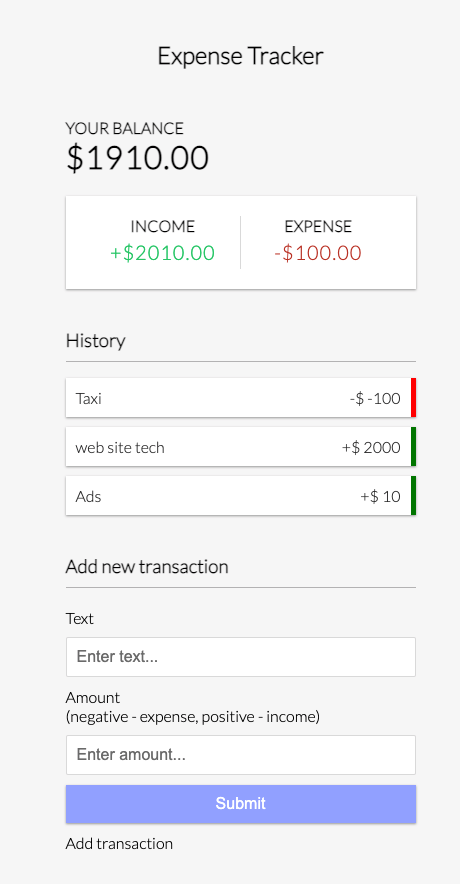

# 09 Expense Tracker Array Methods & Local Storage

Keep track of income and expenses. Add and remove items and save to local storage

## Project Specifications
Create UI for project
Display transaction items in DOM
Show balance, expense and income totals
Add new transation and reflect in total
Delete items from DOM
Persist to local storage

